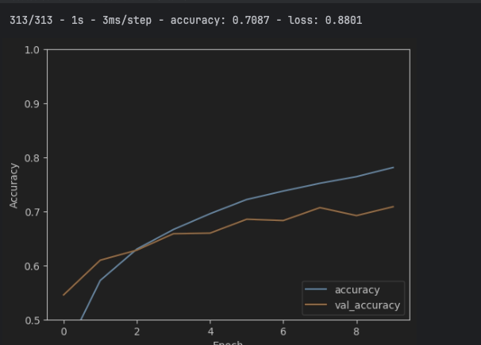

TensorFlow
======================

> 팀원
>  - 강혜원
>  - 박경민
>  - 이동훈
>  - 컴퓨터학부/2020111931/이시욱
>  - 컴퓨터학부/2020110353/장호진
 
목차
======================
> 1. 개요
> 2. 라이선스
> 3. 주요기능
>    - 강혜원
>    - 박경민
>    - 이동훈
>    - 이시욱
>    - 합성곱 신경망(Convolutional Neural Network, CNN)과 이미지 분류
****

# 1. 개요
내용
****

# 2. 라이선스
내용
****

# 3. 주요기능
내용

## 3.1. 강혜원

## 3.2. 박경민

## 3.3. 이동훈

## 3.4. 이시욱

## 3.5. 합성곱 신경망(Convolutional Neural Network, CNN)과 이미지 분류

 TensorFlow에서는 이미지 인식 및 패턴 인식과 관련된 작업에서 매우 효과적으로 사용되는 기법 중 하나인 합성곱 신경망 기능을 제공합니다.
 이 기능은 입력 이미지를 여러 계층으로 구성된 필터로 스캔하여 특정 맵을 생성하고 이런 필터는 입력된 이미지의 특정 패턴이나 기능을 감지하는 데 사용됩니다.
 아래의 예제는 TensorFlow의 합성곱 신경망 기능을 응용하여 이미지 분류를 하고 그 학습 결과를 출력하는 예제입니다.
 Tensorflow에서는 케라스 Sequential API를 사용하여 간단한 코드를 작성함으로써 모델을 만들고 학습시킬 수 있습니다.
모델 훈련에서 사용될 이미지는 [image pair.png]과 같이 단어와, 단어에 맞는 이미지 쌍으로 제공되고 훈련 이미지와 테스트를 위한 이미지로 구분되어 집니다.
우선 합성곱 신경망은 이미지의 배치된 크기를 무시하고 이미지의 형상에 대한
정보(image_height, image_width, color_channels)의 텐서를 사용합니다.
여기에서 텐서는 벡터들의 집합으로 봅니다.
텐서를 사용하여 합성곱 층을 만드는데 이 때는 CIFAR 이미지 형식인 형상 높이 32, 너비 32, RGB 3쌍의 값을 처리하는 정수 값 3이 정보로 주어집니다.
구체적인 예제 코드는 아래와 같습니다.
```Python
model = models.Sequential()
model.add(layers.Conv2D(32, (3, 3), activation='relu', input_shape=(32, 32, 3)))
model.add(layers.MaxPooling2D((2, 2)))
model.add(layers.Conv2D(64, (3, 3), activation='relu'))
model.add(layers.MaxPooling2D((2, 2)))
model.add(layers.Conv2D(64, (3, 3), activation='relu'))
```

이 중 높이와 너비 차원은 학습이 진행될 수록 감소하는 경향이 있습니다. 
합성곱 층을 만든 결과는 [convolution layer.png]와 같습니다.
기본적인 합성곱 층이 완성 된 이후에는 Dense층을 추가하여야 하는데 Dense층은 위에서 구한 합성곱의 연산 결과를 하나 이상의 Dense 층에 입력으로 주어서 분류를 수행합니다.
여기서의 주의할 점은 Dense층의 오기 전까지의 연산 결과는 차원이 3개이지만 입력으로 넣을 때에는 1차원으로 변환을 수행해야합니다. 변환을 수행한 이후의 결과는 [added dense.png]과 같습니다.Dense층 추가의 예제 코드는 아래와 같습니다.
```Python
model.add(layers.Flatten())
model.add(layers.Dense(64, activation='relu'))
model.add(layers.Dense(10))
```
이렇게 만들어진 텐서들을 컴파일 한 이후 실행한 결과를 학습 횟수에 따라 그래프로 나타낸 결과는 아래의 [conclusion.png]와 같습니다.
학습 이후 모델 평가를 위한 코드는 아래와 같습니다.
```Python
plt.plot(history.history['accuracy'], label='accuracy')
plt.plot(history.history['val_accuracy'], label = 'val_accuracy')
plt.xlabel('Epoch')
plt.ylabel('Accuracy')
plt.ylim([0.5, 1])
plt.legend(loc='lower right')

test_loss, test_acc = model.evaluate(test_images,  test_labels, verbose=2)
```
결과에 있어서 accuracy는 모델이 올바르게 데이터를 분류한 비율을 나타내며 val_accuracy는 검증 정확도라고 불리는 모델이 훈련 데이터를 기반으로 학습한 이후 검증 데이터를 사용하여 모델의 성능을 표현할 때 사용하는 지표입니다.
두 accuracy 값이 학습을 진행함에 따라서 증가하는 추이를 보이고 있음을 알수 있습니다.




